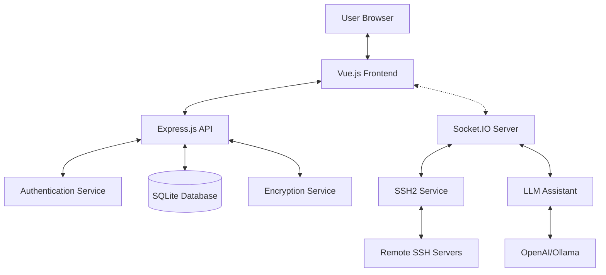

# 📡 IntelliSSH

A secure, user-friendly web application for managing and controlling Linux hosts via SSH directly in the browser. IntelliSSH enables system administrators, developers, and DevOps engineers to access, manage, and troubleshoot remote servers through an intuitive web interface with advanced security features.


## 🚀 Overview

IntelliSSH transforms remote server management by providing:

- **Browser-based SSH access** — No need for desktop SSH clients
- **Centralized session management** — Store and organize all your SSH connections
- **Enhanced security** — End-to-end encryption and secure credential storage
- **AI-powered assistance** — Get intelligent command suggestions and troubleshooting help
- **Modern, responsive interface** — Work efficiently from any device

## ✨ Features

- **🔐 Secure Authentication System**
  - JWT-based user authentication with bcrypt password hashing
  - Password reset functionality with email verification
  - User profile management with customizable settings
  - Brute-force protection with rate limiting

- **🖥️ Advanced Web Terminal**
  - Full-featured terminal emulation using xterm.js
  - Support for ANSI colors, cursor movements, and special keys
  - Automatic terminal resizing with window adjustments
  - Copy/paste functionality and keyboard shortcuts

- **💾 Comprehensive Session Management**
  - Create, edit, duplicate, and delete SSH sessions
  - Organize sessions with tags and custom categories
  - Quick connection testing before establishing full sessions
  - Session history with connection timestamps

- **🔒 Enterprise-Grade Security**
  - AES-256 encryption for sensitive data (passwords, SSH keys)
  - Zero storage of plaintext credentials
  - Secure token handling with automatic expiration
  - Database encryption for all sensitive information

- **🔌 Flexible Authentication Methods**
  - Password-based SSH authentication
  - Private key authentication with optional passphrase
  - SSH agent forwarding support
  - Host-based authentication compatibility

- **🚀 Real-time Communication**
  - WebSocket-based terminal interaction for low latency
  - Automatic reconnection on network interruptions
  - Session persistence across page reloads
  - Real-time connection status indicators

- **🤖 LLM Terminal Assistant**
  - AI-powered terminal helper with command suggestions
  - Support for both OpenAI and Ollama models
  - Command execution with user approval workflow
  - Context-aware help for error troubleshooting
  - Terminal output analysis for intelligent assistance

- **📱 Modern User Experience**
  - Responsive design works on desktops, tablets, and phones
  - Dark mode support for reduced eye strain
  - TailwindCSS for consistent, clean UI components
  - Intuitive navigation and context-sensitive help

- **🐳 Deployment Flexibility**
  - Complete containerized deployment with Docker Compose
  - Simple environment configuration
  - Persistent data volumes for database storage
  - Easy updates and rollbacks

- **📧 Email Notification System**
  - Password reset workflows
  - Security alerts for suspicious activities
  - Customizable email templates
  - Support for SMTP configuration

## 🏗️ Architecture

IntelliSSH follows a modern client-server architecture designed for security, performance, and extensibility.



## 🚀 Quick Start

### Prerequisites

- **Node.js** 18+ (for development)
- **Docker** and **Docker Compose** (for production deployment)

### Development Setup

1. **Clone the repository**
   ```bash
   git clone <repository-url>
   cd webssh-control
   ```

2. **Set up the server**
   ```bash
   cd server
   npm install
   cp .env.example .env
   # Edit .env with your configuration
   npm run dev
   ```

3. **Set up the client** (in a new terminal)
   ```bash
   cd client
   npm install
   npm run dev
   ```

4. **Access the application**
   - Frontend: http://localhost:8080
   - Backend API: http://localhost:3000

### Production Deployment with Docker

1. **Clone and configure**
   ```bash
   git clone <repository-url>
   cd webssh-control
   ```

2. **Start the application**
   ```bash
   docker-compose up -d
   ```

3. **Access the application**
   - Web Interface: http://localhost:8080
   - API: http://localhost:3000


### Security Considerations

1. **Change default secrets**: Always set strong, unique values for `JWT_SECRET` and `ENCRYPTION_KEY`
2. **Use HTTPS**: In production, serve over HTTPS with proper certificates
3. **Network security**: Ensure the application is behind a firewall
4. **Regular updates**: Keep dependencies updated for security patches
5. **Least privilege**: Run containers and services with minimal required permissions
6. **Audit logging**: Enable logging for security events and access

## 🔧 Usage Guide

### First Time Setup
1. **Login Admin Account**: Visit the application and with the generated admin account (visible in Server logs)
2. **Configure email settings**: Set up SMTP details for password reset functionality
3. **Create a session**: Add your first SSH session with connection details
4. **Connect**: Click "Connect" to establish an SSH session

### Managing Sessions

#### Create a New Session

1. Click "New Session"
2. Fill in the connection details:
   - **Session Name**: A friendly name for identification
   - **Hostname/IP**: The target server address
   - **Port**: SSH port (default: 22)
   - **Username**: SSH username
   - **Authentication**: Choose password, private key, or SSH agent
3. Optional: Add tags for organization
4. Click "Save" to store the session

#### Authentication Methods

- **Password**: Store encrypted password for authentication
- **Private Key**: Store encrypted SSH private key
  - Paste your private key directly
  - Optional passphrase support
- **SSH Agent**: Use local SSH agent (no credentials stored)

### Terminal Features

- **Full terminal emulation**: Supports colors, cursor movements, and special keys
- **Copy/Paste**: Standard browser copy/paste functionality
- **Resize**: Terminal automatically resizes with window
- **Connection status**: Real-time connection status indicator
- **Disconnection handling**: Graceful handling of network interruptions

### Using the LLM Terminal Assistant

The AI-powered terminal assistant helps you work more efficiently:

1. **Enable the assistant**: Toggle the switch in the terminal sidebar
2. **Automatic suggestions**: Receive command suggestions based on terminal context
3. **Ask for help**: Type questions in the assistant input field
4. **Command approval**: Review and approve suggested commands before execution
5. **Context-aware help**: Get assistance relevant to your current terminal session

Example use cases:
- Get explanations for error messages
- Receive suggestions for complex commands
- Learn about system status information
- Troubleshoot connectivity issues

### User Profile Management

1. Access your profile by clicking your username
2. Update personal information
3. Change password
4. Configure preferences and settings

### Application Settings

Administrators can configure:
- Email notification settings
- Security parameters
- LLM provider settings
- User session timeouts
- Global application preferences

## 🛠️ Development

### Project Structure

```
webssh-control/
├── client/                 # Vue 3 Frontend
│   ├── src/
│   │   ├── components/     # Vue components
│   │   ├── stores/         # Pinia stores
│   │   ├── views/          # Page components
│   │   ├── router/         # Vue Router config
│   │   └── utils/          # Utility functions
│   └── package.json
├── server/                 # Node.js Backend
│   ├── src/
│   │   ├── api/            # API routes
│   │   ├── services/       # Business logic
│   │   ├── models/         # Data models
│   │   ├── middleware/     # Express middleware
│   │   ├── socket/         # WebSocket handlers
│   │   └── db/             # Database setup
│   └── package.json
├── docker/                 # Docker configurations
├── docs/                   # Documentation files
└── docker-compose.yml      # Orchestration
```

### Running Tests

```bash
# Server tests
cd server
npm test

# Client tests  
cd client
npm run test
```

### Building for Production

```bash
# Build client
cd client
npm run build

# The built files will be in client/dist/
```

## 🔌 API Documentation

### Authentication Endpoints

- `POST /api/auth/register` - Register new user
- `POST /api/auth/login` - User login
- `POST /api/auth/logout` - User logout
- `GET /api/auth/me` - Get current user
- `POST /api/auth/refresh` - Refresh JWT token
- `POST /api/auth/forgot-password` - Initiate password reset
- `POST /api/auth/reset-password` - Complete password reset

### User Profile Endpoints

- `GET /api/profile` - Get user profile
- `PUT /api/profile` - Update user profile
- `PUT /api/profile/password` - Change user password

### Session Endpoints

- `GET /api/sessions` - Get user sessions
- `POST /api/sessions` - Create new session
- `GET /api/sessions/:id` - Get specific session
- `PUT /api/sessions/:id` - Update session
- `DELETE /api/sessions/:id` - Delete session
- `POST /api/sessions/:id/duplicate` - Duplicate session
- `POST /api/sessions/:id/test` - Test SSH connection

### Settings Endpoints

- `GET /api/settings` - Get application settings
- `PUT /api/settings` - Update application settings
- `GET /api/settings/email` - Get email settings
- `PUT /api/settings/email` - Update email settings

### Debug Endpoints (Development Only)

- `GET /api/debug/health` - Check API health
- `GET /api/debug/config` - View sanitized configuration

### WebSocket Events

#### Client → Server
- `authenticate` - Authenticate socket connection
- `connect-session` - Connect to SSH session
- `disconnect-session` - Disconnect from SSH session
- `terminal-input` - Send terminal input
- `terminal-resize` - Resize terminal
- `llm-query` - Send query to LLM assistant
- `llm-approve-command` - Approve command suggestion
- `llm-reject-command` - Reject command suggestion

#### Server → Client
- `authenticated` - Authentication successful
- `connection-established` - SSH connection established
- `terminal-output` - Terminal output data
- `terminal-disconnected` - SSH connection closed
- `terminal-error` - Terminal error occurred
- `llm-response` - LLM assistant response
- `llm-command-suggestion` - Command suggestion from LLM

## 🤝 Contributing

1. Fork the repository
2. Create a feature branch: `git checkout -b feature/amazing-feature`
3. Commit your changes: `git commit -m 'Add amazing feature'`
4. Push to the branch: `git push origin feature/amazing-feature`
5. Open a Pull Request

### Code Style

This project follows:
- ESLint configuration for JavaScript/Vue code
- Prettier for code formatting
- Conventional Commits for commit messages

## 📋 Roadmap

### Planned Features

- **📁 SFTP Support**: File browser and transfer capabilities
- **📊 Logging & Monitoring**: Session activity logs and metrics
- **👥 Session Sharing**: Share terminal sessions with other users
- **🔧 Bulk Operations**: Manage multiple sessions simultaneously
- **🔑 SSH Key Management**: Built-in SSH key generation and management
- **📜 Connection Templates**: Predefined connection templates
- **🌐 Multi-language Support**: Internationalization (i18n)
- **🔔 Push Notifications**: Real-time alerts for terminal events
- **📱 Mobile App**: Native mobile applications
- **🔄 Multi-server Commands**: Run commands across multiple servers

## 🐛 Troubleshooting

### Common Issues

#### Connection Failed
- Verify SSH credentials are correct
- Check if target host is reachable
- Ensure SSH service is running on target host
- Check firewall settings
- Verify the SSH port is open and accessible

#### WebSocket Connection Issues
- Verify backend is running and accessible
- Check browser console for errors
- Ensure no proxy blocking WebSocket connections
- Validate that your browser supports WebSockets

#### Authentication Problems
- Clear browser storage and try again
- Verify JWT_SECRET is consistent
- Check server logs for detailed error messages
- Ensure your account hasn't been locked due to failed attempts

#### LLM Assistant Not Working
- Check that LLM provider settings are correct
- Verify API keys are valid
- For Ollama, ensure the local service is running
- Check server logs for LLM-related errors

### Logs

#### Server Logs
```bash
# Docker Compose
docker-compose logs webssh-server

# Development
cd server && npm run dev
```

#### Client Logs
Check browser developer console for frontend logs.

### Data Recovery

If you need to recover from database corruption:
1. Stop the application
2. Copy the backup file: `cp server/data/webssh.db.bak server/data/webssh.db`
3. Restart the application

## 📄 License

This project is licensed under the ISC License - see the LICENSE file for details.

## 🙏 Acknowledgments

- [xterm.js](https://xtermjs.org/) - Terminal emulation
- [SSH2](https://github.com/mscdex/ssh2) - SSH client
- [Vue.js](https://vuejs.org/) - Frontend framework
- [TailwindCSS](https://tailwindcss.com/) - CSS framework
- [Socket.IO](https://socket.io/) - Real-time communication
- [OpenAI API](https://openai.com/) - AI capabilities
- [Ollama](https://ollama.ai/) - Local AI model serving
- [SQLite](https://www.sqlite.org/) - Database engine
- [Express](https://expressjs.com/) - Web framework

---

**⚠️ Security Notice**: This application handles SSH credentials and provides terminal access. Ensure proper security measures are in place when deploying to production environments.
